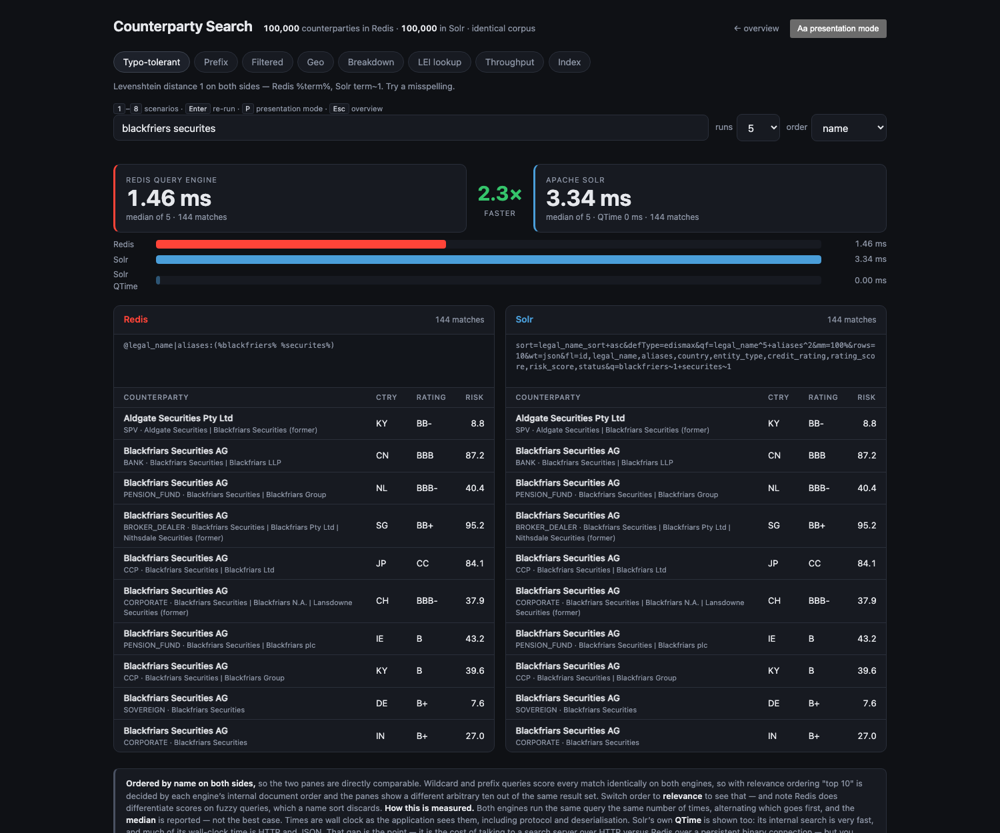

# redis-v-solr-demo

Side-by-side counterparty search: **Redis Query Engine** vs **Apache Solr**, on
the same laptop, over an identical 100,000-record corpus, with per-query latency
shown live.

Built for a financial-services counterparty-search conversation — the query
shapes that actually show up in KYC and onboarding work.



> **Method, caveats and the 1M results live in
> [docs/METHODOLOGY.md](docs/METHODOLOGY.md).** Read it before presenting: it
> covers how fairness is enforced, the scenario Solr wins, and why the result
> largely inverts at a million records.

## Quick start

**Two commands after cloning:**

```bash
npm install
npm run demo
```

Then open **<http://localhost:3010>**.

`npm run demo` starts both containers, waits for Solr, generates 100,000
counterparties, loads them into Redis and Solr, and starts the web server. On a
machine that already has the Docker images it finishes in about **10 seconds**.
The first ever run also pulls Redis 8 (166 MB) and Solr 9 (691 MB), so allow a
few minutes for that.

### Before you start

| Need | Why |
| ---- | --- |
| **Docker** with Compose v2 (`docker compose`, not `docker-compose`) | runs both engines |
| **≥ 4 GB** available to Docker | Solr is given a 2 GB heap; Redis uses ~250 MB at 100k |
| **Node.js 18+** | the app uses global `fetch` |
| Ports **3010**, **6380**, **8983** free | app, Redis, Solr |

Redis is on **6380** rather than the default 6379 specifically so it can't
collide with a Redis you already have running.

### Running the steps individually

```bash
docker compose up -d          # Redis 8 on :6380, Solr 9 on :8983
npm run seed                  # generate 100k records, load both engines
npm start                     # http://localhost:3010
```

`npm run seed` waits for Solr to accept connections before loading it, so there's
no need to sleep between these.

### Stopping and coming back

```bash
docker compose down           # add -v to delete the volumes too
```

The containers hold no volumes, so `docker compose down` discards the data.
Re-run `npm run demo` — it's idempotent, and both seeders wipe their engine
before loading.

## The nine scenarios

| Scenario | The real-world question | Redis | Solr |
| -------- | ----------------------- | ----- | ---- |
| **Typo-tolerant name** | "Our file says *Kestral Capitol* — who is that?" | `%term%` (Levenshtein 1) | `term~1` |
| **Prefix / autocomplete** | An analyst typing a name, one query per keystroke | `term*` | `term*` |
| **Filtered screening** | Name match, restricted by eight screening filters | `TAG` + `NUMERIC` clauses | `fq` filter queries |
| **Geo proximity** | "Which counterparties are within 50km of London?" | `@location:[lon lat r km]` | `{!geofilt}` |
| **Portfolio breakdown** | "Total exposure by credit rating" | `FT.AGGREGATE` | JSON Facet API |
| **Exact LEI lookup** | Known-item retrieval by identifier | `HGETALL` — no index at all | `q=id:"…"` |
| **Concurrent throughput** | "Will it keep up at our peak?" | `npm run bench` | `npm run bench` |
| **Semantic & hybrid** | "Which counterparties have liquidity problems?" | `KNN` on a `VECTOR` field | `{!knn}` on `DenseVectorField` |
| **Index & schema** | "What did you actually build?" | one `FT.CREATE` | core + Schema API per field |

The exact query sent to each engine is displayed under its results pane, so
there's nothing hidden. Each tab draws a fresh query from a pool on entry, so
nothing is a canned string.

Filtered screening exposes eight filters — country, credit rating floor, status,
entity type, sector, risk ceiling, minimum exposure, onboarding recency — and
they compose. `kes` alone matches 2,210 counterparties; adding
`entity_type=BANK` cuts it to 229, `sector=Energy` to 14, and
`exposure ≥ $1bn` to 10.

Two UI controls worth knowing about:

- **order** defaults to *name*, which makes the two panes line up row for row.
  Wildcard queries are constant-scored on both engines, so with relevance
  ordering each pane shows a different arbitrary ten out of an identical result
  set. [Details](docs/METHODOLOGY.md#result-ordering).
- **presentation mode** (or `P`) scales the whole UI for a projector.
  `1`–`9` switch scenarios, `Enter` re-runs, `Esc` returns to the overview.

## Observed on one laptop

**Measured 2026-08-26.** 100,000 counterparties, Redis 8.10.1 and Solr 9 both in
Docker on a 14-core Apple-silicon MacBook, Solr on a 2 GB heap. Median of 11 runs
per sample, median of 5 samples. **Indicative, not a benchmark** — see
[Methodology](docs/METHODOLOGY.md).

| Scenario | Redis | Solr (wall) | Solr (QTime) | Ratio |
| -------- | ----- | ----------- | ------------ | ----- |
| Exact LEI (`HGETALL`) | 0.74 ms | 3.87 ms | ~0 ms | **5.3×** |
| Typo-tolerant name | 1.46 ms | 6.03 ms | ~0 ms | **4.1×** |
| Prefix | 1.87 ms | 5.25 ms | ~0 ms | **2.8×** |
| Filtered screening | 1.83 ms | 4.52 ms | ~0 ms | **2.5×** |
| Geo, 50 km radius | 3.30 ms | 4.70 ms | ~0 ms | **1.4×** |
| Portfolio breakdown | 10.22 ms | 7.18 ms | ~2 ms | 0.70× — **Solr wins** |

Indexing the same 100k records:

| | Redis | Solr |
| --- | ----- | ---- |
| Load rate | ~56,000 docs/sec | ~24,000 docs/sec |
| Commit before searchable | none | 0.2–0.7 s hard commit |
| Write-to-visible | ~5 ms | until commit, or your soft-commit window |

That second table is arguably the more interesting one for counterparty
reference data, where a newly sanctioned entity being invisible until the next
commit has compliance consequences.

**The result holds under scrutiny.** Twelve *distinct* queries, one run each, so
Solr's filterCache gets no reuse: prefix 2.6×, filtered 3.6×. Redis leads whether
queries repeat or not, which is what makes 100k the honest place to run this
demo rather than merely the flattering one.

**Two things not to overclaim.** Solr's `QTime` is ~0, so much of its wall clock
is HTTP and JSON rather than searching — both numbers are shown in the UI for
that reason. And at **1,000,000** records the latency result largely inverts.
Both are covered in [Methodology](docs/METHODOLOGY.md).

## Concurrent throughput

```bash
npm run bench                                          # prefix, 16 threads, 10s
npm run bench -- --scenario=filtered --concurrency=32
npm run bench -- --scenario=lei --duration=30
```

| Concurrency | Redis QPS | Solr QPS | Redis p99 | Solr p99 |
| ----------- | --------- | -------- | --------- | -------- |
| 8 | 10,227 | 4,273 | 1.23 ms | 2.58 ms |
| 16 | 11,401 | 7,776 | 2.69 ms | 3.59 ms |
| 32 | 11,553 | 8,494 | 5.88 ms | 10.69 ms |
| 48 | 11,848 | **5,377** | 8.17 ms | **53.05 ms** |

Redis saturates near 11–12k QPS and stays flat. Solr peaks around 32 threads then
*falls* — past its knee, more clients make it slower. The tail diverges faster
than the median: at 48 threads p50 differs by 1.6× but p99 by 6.5×.

It's a CLI tool rather than a UI button because driving load from the web server
would have the load generator competing with what it's measuring. Full
methodology, and where Redis Software's query performance factor fits, in
[Methodology](docs/METHODOLOGY.md#concurrent-throughput).

## Semantic search — and yes, Solr does vectors

Each counterparty carries a narrative credit-review note. Those notes are
embedded locally with **all-MiniLM-L6-v2** (384 dimensions, via
transformers.js — no API key, no network at query time) and indexed as vectors
in both engines, so you can ask questions in English:

> *"which counterparties have liquidity problems?"*
> *"who is under sanctions review?"*
> *"firms with commercial real estate concentration"*

**Solr can do this too**, which is worth knowing before a customer asks:
`solr.DenseVectorField` with an HNSW index and the `{!knn}` query parser. That
was verified against this image before the tab was built, not assumed — so this
tab is a like-for-like comparison, not a capability gap.

The tab has two modes:

- **vector only** — pure semantic search across the whole corpus.
- **hybrid** — the same vector search, narrowed by jurisdiction, rating, status
  and a keyword the note must contain. Redis expresses that as a single query
  where the filter runs *before* the KNN; Solr takes the filters as separate
  `fq` parameters.

Enabling it is a separate step because embedding 100,000 notes takes about
**11 minutes** on a laptop:

```bash
npm run seed:vectors      # generate + embed + load both engines
```

Without it the tab explains what to run; every other scenario works as normal.

Notes on interpreting the tab, in
[Methodology](docs/METHODOLOGY.md#semantic-and-hybrid-search): the engines agree
on roughly half the top ten, because HNSW is approximate on both sides; the
embedding time is reported separately since it's identical for both; and the
Redis index grows from 70.6 MB to ~305 MB once vectors are in it.

## Data model

100,000 synthetic counterparties. The names are invented — deliberately not real
institutions, because attaching fabricated credit ratings and risk scores to real
firms would be misleading in a customer meeting.

In Redis each record is one **Hash** at `cp:<LEI>`, with a single index over the
key prefix. Nothing is copied into the index — it points at the Hashes already in
the keyspace. The **Index & schema** tab shows the reconstructed `FT.CREATE`.

Two modelling details worth pointing out in a demo:

- **`rating_score` is the numeric twin of `credit_rating`.** Ratings are ordinal
  (`D` … `AAA`), so scoring them 1–22 turns "BBB- or better" into one range query
  instead of ten equality checks.
- **`aliases` carries short forms and pre-merger names.** That's where
  counterparty matching gets hard: the same entity arrives as a short form from
  one system and a former name from another. It's also why a search for `kes`
  legitimately returns "Aberdare Advisory GmbH" — it holds the alias
  `Kestrel Advisory (former)`.

## Layout

```
docker-compose.yml     Redis 8 (:6380) and Solr 9 (:8983)
src/
  config.js            ports, URLs, corpus size, PRNG seed
  generate.js          writes data/counterparties.jsonl
  seed-redis.js        HSET + FT.CREATE
  seed-solr.js         Schema API + bulk post + commit + cache warm-up
  queries.js           both engines' query construction, side by side
  ft-info.js           FT.INFO parsed from the raw reply
  bench.js             concurrent throughput benchmark
  server.js            API + static hosting
public/index.html      the whole UI, one file
docs/METHODOLOGY.md    method, caveats, 1M results
```

`src/queries.js` is the file to read to check the two engines are being asked the
same question. That's why both live together.

## Configuration

| Variable | Default | Purpose |
| -------- | ------- | ------- |
| `COUNT` | `100000` | Corpus size for `npm run generate` |
| `REDIS_URL` | `redis://localhost:6380` | Redis connection |
| `SOLR_URL` | `http://localhost:8983/solr/counterparties` | Solr core |
| `PORT` | `3010` | Demo web server |

```bash
npm run seed:1m                # 1,000,000 records — read the methodology first
PORT=3011 npm start
```

## Troubleshooting

| Symptom | Fix |
| ------- | --- |
| `index cp:idx not found — run: npm run seed` | The Redis container was recreated. Re-run `npm run seed`. |
| `Solr did not become ready within 120s` | `docker compose logs solr`. Usually Docker is short on memory — Solr asks for a 2 GB heap, so give Docker at least 4 GB. |
| `Solr not reachable … is docker compose up?` | `docker compose ps`. The seeder waits for Solr itself, so this usually means the container isn't running at all. |
| Corpus banner says **COUNTS DIFFER** | The engines hold different data; the comparison is invalid until you re-run `npm run seed`. |
| `Port 3010 is in use` | `PORT=3011 npm start` |
| `npm install` fails about root-owned files in the npm cache | A known npm cache-permission issue unrelated to this project: `npm install --cache "$(mktemp -d)"`. |
| `docker: 'compose' is not a docker command` | Compose v2 needed. Update Docker Desktop, or substitute `docker-compose up -d`. |

## Not safe to expose

No authentication, no rate limiting. It's a local demo: bind it to localhost and
keep Redis and Solr off any network you don't control.
